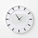

# ⏰ YouTube Video Scheduler

## 📅 Overview
This Browser extension allows you to schedule YouTube videos for later viewing. You can easily add, update, or remove scheduled videos directly from your browser. Additionally, the extension provides a real-time update of the video duration when you change the playback speed, helping you better manage your viewing time.

## ✨ Features
- **Schedule YouTube Videos:** Add any YouTube video to your schedule for later viewing.
- **Update or Remove Schedules:** Easily update the scheduled time or remove videos from your schedule.
- **User-Friendly Dashboard:** Manage all your scheduled videos in a clean and intuitive dashboard.
- **Real-Time Duration Update:** Instantly see the updated duration of a YouTube video when you change its playback speed (bonus feature).

## ⚙️ How to Use
1. Download the extension from chrome web store or firefox add ons store.
2. Hover on any of the video, (you'll see the hover icon), click on it to set the schedule time.
3. Press Ctrl+Shif+S to toggle the schedule dashboard for editing or deleting the schedule.

## 🌱 Getting Started
1. Clone this repository.
2. Follow [WXT Docs](https://wxt.dev/guide/installation.html) to run this project.

## 🤝 Contribution
Contributions are welcome! To contribute:
1. Fork the repository.
2. Create a new branch for your feature or bugfix.
4. Submit a pull request with a clear description of your changes.

For major changes, please open an issue first to discuss what you would like to change.

## 📜 License
This project is licensed under the MIT License.

##### Made with [WXT](https://wxt.dev/) framework.